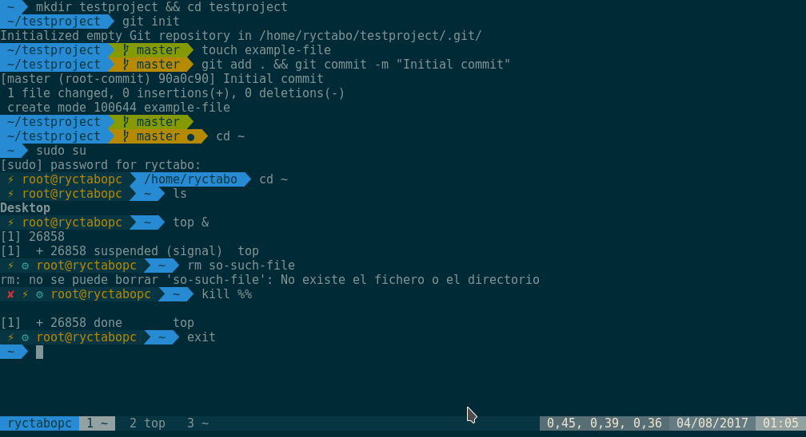

# ryctabo's dotfiles


These are my dotfiles. Take anything you want, but at your own risk.

## How to install?
Make sure that before performing the installation make a backup of your files.

```bash
git clone git@github.com:ryctabo/docfiles.git ~/.dotfiles
ln -sv ~/.dotfiles/tmux/.tmux.conf ~
ln -sv ~/.dotfiles/zsh/.zshrc ~
ln -sv ~/.dotfiles/git/.gitconfig ~
```

Thanks for visiting my dotfiles. :wink:
